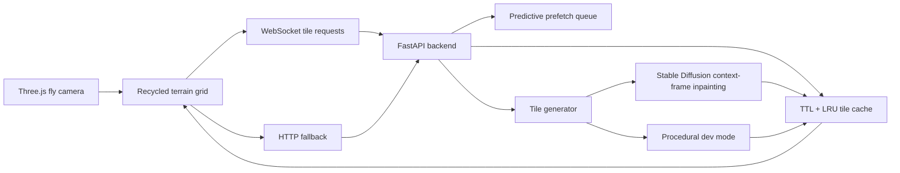

# InfiniteCanvas

InfiniteCanvas is a 3D world explorer. frontend is a full-screen Three.js fly-through scene that recycles terrain planes around the camera. The backend serves deterministic tile images through FastAPI, with an optional Diffusers path that uses context-frame inpainting for InfiniteDiffusion-style lazy generation.



## What's Implemented

- Three.js infinite terrain grid with plane recycling around the camera.
- Pointer-lock fly camera with WASD movement and mouse look.
- WebSocket tile loading with HTTP fallback and reconnection.
- Biome switching for forest, desert, ocean, and alien terrain.
- Mini-map showing loaded and pending tile state.
- Tile LOD requests: nearby tiles request 512px textures, distant tiles request 256px textures.
- FastAPI `/generate_tile` endpoint returning PNG tiles.
- FastAPI `/ws/tiles` endpoint for lower-latency tile requests and predictive prefetch.
- TTL + LRU cache and a single-concurrency generation guard to avoid request storms.
- Optional Diffusers generator using a larger context canvas and inpainting mask to condition on neighbor edges.
- Backend tests for coordinates, cache behavior, determinism, and adjacent tile edge continuity.

## Run The Backend

```powershell
cd backend
python -m pip install -r requirements.txt
python -m uvicorn app.main:app --reload --host 127.0.0.1 --port 8000
```

The default mode is `procedural`, which is deterministic and fast enough for local demos without a GPU.

## Run The Frontend

```powershell
cd frontend
npm install
npm run dev
```

Open [http://127.0.0.1:5173](http://127.0.0.1:5173).

## Diffusers Mode

Use Python 3.10-3.12 for the GPU environment. Install the Torch wheel that matches your CUDA runtime, then install Diffusers dependencies:

```powershell
cd backend
python -m pip install -r requirements.txt
python -m pip install diffusers transformers accelerate safetensors
$env:INFINITE_CANVAS_GENERATOR="diffusers"
$env:INFINITE_CANVAS_INPAINT_MODEL_ID="runwayml/stable-diffusion-inpainting"
$env:INFINITE_CANVAS_DIFFUSION_STEPS="10"
python -m uvicorn app.main:app --host 127.0.0.1 --port 8000
```

The context-frame path builds a 768x768 canvas for a 512px tile when `INFINITE_CANVAS_CONTEXT_PX=128`. Already generated neighbor edges are pasted around the target region, the center is inpainted, then the tile is cropped and edge-blended before caching.

## API

```http
POST /generate_tile
Content-Type: application/json

{
  "x": 0,
  "y": 0,
  "seed": 1337,
  "biome": "forest",
  "lod": 512
}
```

The response body is `image/png`. Metadata is returned in `X-InfiniteCanvas-Meta`.

WebSocket messages use `/ws/tiles`:

```json
{
  "type": "tile.request",
  "requestId": "client-generated-id",
  "x": 0,
  "y": 0,
  "seed": 1337,
  "biome": "forest",
  "lod": 512
}
```

## Tests

```powershell
cd backend
$env:PYTHONPATH="."
python -m pytest
```

